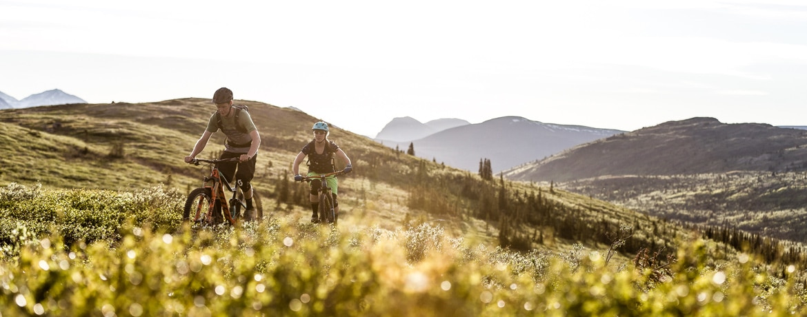

# Great_Outdoors						

About									
Visit for our Heroku site [here](https://great-outdoors.herokuapp.com/)
Our group chose to use mock data from a store, The Great Outdoors. The dataset contains store information, product information, recent orders, store location, and sales and revenue figures. We stored the data in a SQLite database and utilized the database to create a flask app.

# Leaflet
## We used leaflet to build a geomap where we placed markers on store locations and added a tooltip to display store revenue data.

# D3 Visualization
## We used D3 to visualize total revenue month-to-month with a line graph including tooltips. 

# Google Data Studio
## Dashboarding was done in Google Data Studio. 

## Our project has a home page and about page with a short description of our project, an introduction to our project group members, and an intro to our project pages. We have three visualizations, which will result in a total of four pages. The page will have a navigation bar for page interaction. 

# Contributors
Matthew Ashe - Leaflet
Cindy Brady - Heroku and Website
Brittany Chin - D3 Visualization
Conner Mixon - Google Data Studio and SQLite
Robert Norris - Leaflet and Heroku
Chris Williams - D3 Visualization  